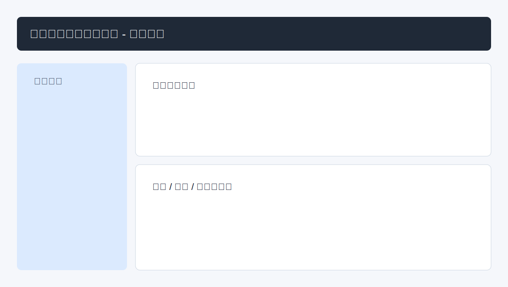

# 项目合同付款管理系统（projrct）

一个基于 **FastAPI + React + TypeScript + Ant Design** 的项目合同付款管理系统，支持项目、合同、付款、变更记录管理，以及 Excel 导入导出与截图识别导入能力。

## 功能列表

- 项目管理：项目增删改查、状态筛选与关键词搜索。
- 合同管理：合同主信息维护、标的清单、付款计划、变更记录子资源管理。
- 付款管理：按合同筛选付款记录，自动计算待付款金额。
- 数据导入导出：
  - Excel 模板下载
  - Excel 批量导入（支持跳过/更新重复数据）
  - Excel 数据导出
- 截图导入：上传截图后由 AI 识别并确认入库。
- 数据校验提醒（前端页面）：
  - 合同金额与标的合计不一致时显示警告
  - 付款总额超过合同金额时显示警告
- 统一错误处理：后端提供请求校验、数据库异常、业务异常的统一错误返回。

---

## 快速启动

### 方式一：Docker Compose（推荐）

> 前端容器使用 Nginx 提供静态资源并反向代理 `/api` 到后端 Uvicorn。

```bash
docker compose up --build
```

启动后访问：

- 前端：<http://localhost>
- 后端健康检查：<http://localhost:8000/>
- API 文档（Swagger）：<http://localhost:8000/docs>
- API 文档（ReDoc）：<http://localhost:8000/redoc>

### 方式二：本地开发启动

#### 1）启动后端

```bash
python -m venv .venv
source .venv/bin/activate
pip install -r requirements.txt
uvicorn backend.app.main:app --reload --host 0.0.0.0 --port 8000
```

#### 2）启动前端

```bash
cd frontend
npm install
npm run dev -- --host 0.0.0.0 --port 5173
```

访问：<http://localhost:5173>

---

## 截图示意

> 下图为页面结构示意图（占位示意，可替换为真实业务截图）。



---

## API 文档地址

- Swagger UI：<http://localhost:8000/docs>
- ReDoc：<http://localhost:8000/redoc>

---

## 目录结构（核心）

```text
backend/
  app/
    main.py                # FastAPI 入口（含全局异常处理）
    routers/               # 业务路由
frontend/
  src/pages/               # 页面组件
  Dockerfile               # 前端镜像构建（Vite build + Nginx）
  nginx.conf               # Nginx 反向代理配置
backend/Dockerfile         # 后端镜像构建（Uvicorn）
docker-compose.yml         # 一键编排
```
